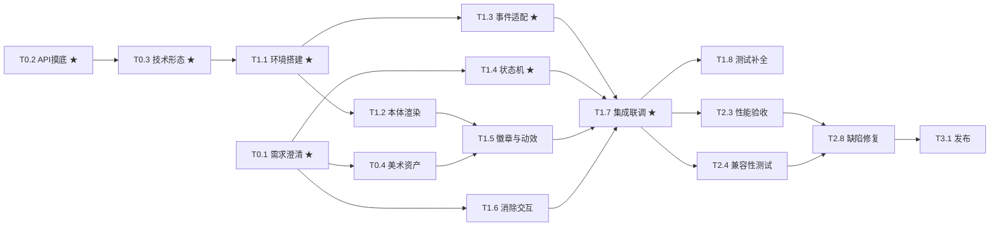

# dsh-pixel-buddy 任务规划文档

| 项目     | 内容                                                     |
| -------- | -------------------------------------------------------- |
| 文档版本 | v0.1（待评审）                                           |
| 编制日期 | 2026-09-04                                               |
| 依据文档 | `docs/dsh-pixel-buddy 产品需求文档.md` 及其需求分析结论  |
| 文档目的 | 指导后续开发排期与执行分工，供项目经理与开发人员直接使用 |

---

## 1. 规划假设与总体说明

- **人力假设**：1 名前端工程师为开发主力；视觉设计 1 名（兼职、外部协作）；产品经理参与阶段 0 澄清与阶段 2 体验验收；测试由前端兼任或专职（待定）。
- **工时口径**：以"人天"计（1 人全天投入），不含例会与日常沟通开销（建议整体另预留约 10% 缓冲）。
- **项目形态**：本项目为**纯前端插件**，无后端服务、无数据库、无服务端部署任务。"部署上线"对应 DSH 插件分发流程。
- **前置结论**（来自需求分析）：PRD 存在 **2 个阻塞性问题**，必须在开发启动前裁决：
  1. "报错/需要人工"徽章的消除途径与 §1.3"点击互动不在本期范围"存在文档矛盾；
  2. DSH Hook API 的能力存在性（尤其是"需要用户介入"类事件、状态快照查询）尚未摸底。
- **"待评估"工时**：因外部依赖（DSH 插件系统文档、视觉设计排期）暂无法估算的，需在对应前置任务完成后 24 小时内回填本表。
- **纯开发工作量参考**：核心编码（T1.1~~T1.6）约 8~~10 人天，其余为摸底、测试、验收与加固工作。

---

## 2. 里程碑总览

| 里程碑 | 阶段                       | 交付目标                                         | 预估工期（日历）       | 出口条件（DoD）                                                                                 |
| ------ | -------------------------- | ------------------------------------------------ | ---------------------- | ----------------------------------------------------------------------------------------------- |
| **M0** | 阶段 0：需求澄清与技术摸底 | 解除全部阻塞项，锁定技术形态、事件契约与资产契约 | 1 周                   | ① 两个阻塞问题有书面结论；② Hook API 附录回填 PRD；③ 插件形态与兼容矩阵确认；④ 设计需求单已提交 |
| **M1** | 阶段 1：MVP 可用版本       | 5 状态徽章端到端跑通，可内部演示                 | 2 周（与 M0 部分并行） | PRD §7 验收标准 1~6 通过；状态机单测覆盖                                                        |
| **M2** | 阶段 2：完整功能与验收版本 | 通过全部验收标准，具备发布条件                   | 1.5~2 周               | PRD §7 验收标准 1~8 全部通过（含性能与兼容性）；文档齐备                                        |
| **M3** | 阶段 3：发布上线（可选）   | 随 DSH 插件分发流程上线                          | 0.5 周                 | 线上可安装运行；回滚方案确认                                                                    |

**总预估：约 24~30 人天**（T0.2、T0.4 两项待评估工时回填后精确化）。

---

## 3. 任务分解

> 优先级说明：**P0 = 核心必做**（缺失则 MVP 不成立或验收无法通过）；**P1 = 重要**（影响完整版本质量，可短期顺延）；**P2 = 可延后/可选**。★ 标注关键路径任务。

### 阶段 0 —— 需求澄清与技术摸底（M0）

| ID   | 任务名称                   | 简要描述                                                                                                                                                                                                           | 前置依赖           | 预估工时                                 | 验收标准                                                                 | 优先级                                   |
| ---- | -------------------------- | ------------------------------------------------------------------------------------------------------------------------------------------------------------------------------------------------------------------ | ------------------ | ---------------------------------------- | ------------------------------------------------------------------------ | ---------------------------------------- |
| T0.1 | 需求澄清评审               | 组织产品/工程评审，逐条裁决需求分析识别的开放问题：①消除途径与 §1.3 的矛盾；②优先级与粘滞规则的交互（报错未消除时新任务到达的行为）；③会话粒度定义（单次请求 vs 整个对话）；④"需要人工"触发场景；⑤PRD §8 全部 4 项 | 无                 | 0.5~1 人天                               | 每个开放问题均有书面结论并回写 PRD 修订版；无"待定"项遗留                | **P0 ★阻塞**                             |
| T0.2 | Hook API 契约摸底（spike） | 阅读/试验 DSH 插件系统 Hook API，确认：事件清单与命名、事件粒度（是否 token 级）、错误详情可读性、多会话/多标签页支持、状态快照查询（刷新恢复）、API 异常时的行为；输出《Hook API 对齐附录》                       | 无（与 T0.1 并行） | 2~3 人天（**待评估**，视现有文档完备度） | 附录文档回填 PRD；每类事件有可运行的最小验证代码；不存在"假设可用"的接口 | **P0 ★阻塞**                             |
| T0.3 | 插件形态与技术栈确认       | 基于 T0.2 结论确认：插件打包/加载方式（script 注入 / Web Component / iframe）、宿主前端技术栈、样式隔离方案（如 Shadow DOM）、浏览器兼容矩阵、构建与本地联调方式                                                   | T0.2               | 1 人天                                   | 输出技术选型一页纸；兼容矩阵书面确认                                     | **P0 ★阻塞**                             |
| T0.4 | 美术资产需求提交与设计启动 | 向视觉设计提交资产需求：1 张本体精灵图 + 4 种徽章、尺寸规格（32~48px 区间）、明暗主题色值、像素颗粒度、交付格式（PNG/SVG/CSS）、交付排期                                                                           | T0.1               | 工程侧 0.5 人天；设计工时**待评估**      | 设计需求单书面确认，含明确交付日期                                       | **P0**（外部长周期依赖，最迟 M0 末启动） |

### 阶段 1 —— MVP 可用版本（M1）

| ID   | 任务名称               | 简要描述                                                                                                                                                                    | 前置依赖                                           | 预估工时                                | 验收标准                                                                                   | 优先级                                 |
| ---- | ---------------------- | --------------------------------------------------------------------------------------------------------------------------------------------------------------------------- | -------------------------------------------------- | --------------------------------------- | ------------------------------------------------------------------------------------------ | -------------------------------------- |
| T1.1 | 工程环境搭建           | 建立插件仓库结构、构建链、lint/format、单测框架、与 DSH Web 的本地加载联调通道                                                                                              | T0.3                                               | 1~2 人天                                | 空插件可在 DSH Web 页面中加载运行，右下角渲染占位宠物图                                    | **P0 ★**                               |
| T1.2 | 宠物本体渲染           | 接入精灵图（可先用占位图），右下角固定悬浮 32~48px，z-index 层级策略，与宿主既有悬浮元素（toast、客服入口等）共存确认                                                       | T1.1                                               | 1 人天                                  | PRD §4.1 全部满足 + 验收标准 1；右下角与宿主悬浮元素无遮挡冲突（有冲突则上报裁决备选方案） | **P0**                                 |
| T1.3 | 事件适配层开发         | 订阅 Hook API 并归一化为内部事件枚举；实现 API 不可用/事件流中断的降级处理（静默回退待机）；事件命名以 T0.2 附录为准                                                        | T1.1、T0.2                                         | 2 人天（视 API 现状可能转为**待评估**） | 适配层单测覆盖全部事件映射；断开/异常场景单测通过；不向宿主页面抛出未捕获异常              | **P0 ★**                               |
| T1.4 | 状态机开发（核心逻辑） | 实现 5 状态 FSM：优先级仲裁（§4.5）、粘滞消失规则（§4.6）、"成功"最短展示时长、爆发事件去抖/合并（对应验收 6 防闪烁）、报错未消除时新任务到达的边界行为（按 T0.1 裁决实现） | T0.1（状态语义）、T1.3（接口契约先行，开发可并行） | 3 人天                                  | §4.5/§4.6 每条规则均有对应单测；随机事件序列 fuzz 测试无状态错乱、无闪烁                   | **P0 ★核心**                           |
| T1.5 | 徽章渲染与过渡动效     | 4 种徽章渲染（符号+颜色双重编码，§4.3）、crossfade 100~150ms（§4.4）、待机徽章出现/消失遵循同一规则；本体零动画                                                             | T1.2（容器结构）、T0.4（正式资产，可先占位）       | 2 人天                                  | PRD 验收标准 2/3/7 通过；用户关闭动画偏好时优雅降级                                        | **P0**                                 |
| T1.6 | 消除交互（条件任务）   | 按 T0.1 裁决实现最小消除途径（如"点击宠物即消除报错/需要人工徽章"，或"由宿主页面操作自动解除"）                                                                             | T0.1、T1.4                                         | 0.5~1 人天                              | 报错/需要人工徽章存在约定消除途径；PRD §1.3 范围声明同步修订，文档矛盾消除                 | **P0**（条件任务，存在性由 T0.1 决定） |
| T1.7 | 全链路集成联调         | 状态机 + 适配层 + 渲染与真实 DSH 会话联调；覆盖正常流、异常流、快速连续事件流                                                                                               | T1.3、T1.4、T1.5、T1.6                             | 2 人天                                  | PRD 验收标准 1~6 全部通过                                                                  | **P0 ★**                               |
| T1.8 | 单测补全与 MVP 冒烟    | 补齐边界用例；执行 MVP 冒烟清单                                                                                                                                             | T1.7                                               | 1 人天                                  | 单测全部通过；冒烟清单无 P0/P1 缺陷                                                        | **P0**                                 |

### 阶段 2 —— 完整功能与验收版本（M2）

| ID   | 任务名称       | 简要描述                                                                                                                                           | 前置依赖                 | 预估工时 | 验收标准                                                                            | 优先级 |
| ---- | -------------- | -------------------------------------------------------------------------------------------------------------------------------------------------- | ------------------------ | -------- | ----------------------------------------------------------------------------------- | ------ |
| T2.1 | 明暗主题适配   | 徽章色值随宿主主题切换（色值以 T0.4 设计规范为准）                                                                                                 | T1.5、T0.4               | 0.5 人天 | 明/暗主题下徽章均清晰可辨，色值符合设计规范                                         | P1     |
| T2.2 | 可访问性完善   | ARIA live region 播报状态变化、`prefers-reduced-motion` 下取消/缩短过渡、色弱场景对比度校验                                                        | T1.5                     | 1 人天   | 屏幕阅读器可感知状态变化；减弱动态效果开启时无 crossfade；对比度达标                | P1     |
| T2.3 | 性能验收与调优 | 制定并执行性能验收方案（CPU/内存对比，落实 PRD 验收 8 的"测试阶段补充"）：验证静止态零 rAF 循环、零常态定时器、事件驱动成立、资源体积符合预算      | T1.7                     | 1 人天   | 验收标准 8 有量化对比数据；无持续性动画循环                                         | **P0** |
| T2.4 | 兼容性测试     | 按 T0.3 确认的浏览器兼容矩阵全量回归                                                                                                               | T1.7                     | 1~2 人天 | 矩阵内浏览器全部通过；缺陷清零或有书面豁免                                          | **P0** |
| T2.5 | 边缘场景加固   | 页面刷新/插件晚加载时的状态恢复（视 T0.2 快照能力）、`stream:end` 丢失的超时降级（单次定时器，不引入轮询）、多标签页行为按 T0.1 结论做最小限度处理 | T1.4、T0.2               | 1~2 人天 | 刷新后状态正确；不出现永久卡死（如永远"运行中"/"报错"）；多标签页行为与书面结论一致 | P1     |
| T2.6 | 动效参数定稿   | 过渡时长与"成功"最短展示时长的实际体验验证（PRD §8.3），会同产品/设计定稿                                                                          | T1.7                     | 0.5 人天 | 参数写入代码常量并回写 PRD/设计规范                                                 | P1     |
| T2.7 | 文档与验收报告 | 接入/使用文档；PRD §7 验收标准 1~8 逐条核验报告                                                                                                    | T2.3、T2.4               | 0.5 人天 | 文档与报告评审通过                                                                  | P1     |
| T2.8 | 缺陷修复缓冲   | 阶段 1/2 遗留缺陷集中修复                                                                                                                          | T2.3、T2.4（缺陷暴露后） | 1~2 人天 | 无 P0/P1 缺陷遗留                                                                   | **P0** |

### 阶段 3 —— 发布上线（可选）（M3）

| ID   | 任务名称         | 简要描述                                                                                             | 前置依赖            | 预估工时   | 验收标准                     | 优先级       |
| ---- | ---------------- | ---------------------------------------------------------------------------------------------------- | ------------------- | ---------- | ---------------------------- | ------------ |
| T3.1 | 发布上线         | 按 DSH 插件分发流程打包发布（流程形态以 T0.3 结论为准），灰度/全量                                   | M2 DoD（T2.8 完成） | 0.5~1 人天 | 线上可安装运行；回滚方案确认 | P1           |
| T3.2 | 后续版本技术预留 | 适配层多会话抽象接口评审（仅评审、不实现），输出后续版本（点击互动、悬浮卡片、多会话聚合等）技术建议 | T1.3                | 0.5 人天   | 复核结论记录在案             | P2（可延后） |

---

## 4. 依赖关系与关键路径

### 4.1 依赖链（文字版）

- **串行主干（关键路径）**：`T0.2 → T0.3 → T1.1 → T1.3(接口先行) → T1.4 → T1.7 → T2.3/T2.4 → T2.8 → T3.1`
  - T1.3 与 T1.4 可并行开发，但 T1.4 的接口契约依赖 T1.3 前期产出；两者汇合于 T1.7，关键路径取较长支线（T1.4）。
- **并行支线 A（需求语义线）**：`T0.1 → T1.4（语义定稿）/ T1.6`
- **并行支线 B（美术线，外部）**：`T0.4 → T1.5（正式资产）`；用占位资产可与设计并行推进，但 M2 出口前必须替换为正式资产并回归。
- **渲染线**：`T1.1 → T1.2 → T1.5`

### 4.2 依赖图

### 4.3 阻塞项识别（必须最先完成）

1. **T0.2 Hook API 契约摸底**：决定事件适配层能否开发、"需要人工"状态是否存在、状态恢复方案是否可行。若 API 不提供"需要用户介入"类事件，MVP 状态模型需裁剪重议。
2. **T0.1 需求澄清**：直接决定 T1.6 是否存在、PRD §1.3 是否修订，进而影响验收标准 4/5 的通过路径。
3. **T0.4 设计资产**：外部周期不可控，须以"占位资产先行"策略兜底。

---

## 5. 优先级总表

| 分类                                | 任务                                                                                                    |
| ----------------------------------- | ------------------------------------------------------------------------------------------------------- |
| **核心必做（P0）**                  | T0.1、T0.2、T0.3、T0.4、T1.1、T1.2、T1.3、T1.4、T1.5、T1.6（条件必做）、T1.7、T1.8、T2.3、T2.4、T2.8    |
| **重要（P1）**                      | T2.1、T2.2、T2.5、T2.6、T2.7、T3.1                                                                      |
| **可延后/可选（P2）**               | T3.2                                                                                                    |
| **明确不做（本 PRD 排除，不排期）** | 点击/拖拽/右键菜单完整互动、悬浮提示卡片、后台任务完成通知、养成/个性化系统、多角色皮肤、多会话聚合展示 |

> 说明：T1.6 属"条件必做"——其存在性由 T0.1 的裁决产生；但无论裁决结果如何，PRD §1.3 与 §4.6/§7 的文档矛盾必须消除，否则验收标准 4/5 无法成立。

---

## 6. 排期建议（日历视图，1 名前端主力 + 兼职设计并行）

| 周次 | 主线工作                      | 并行工作                        |
| ---- | ----------------------------- | ------------------------------- |
| W1   | T0.1 ∥ T0.2 → T0.3            | T0.4 设计启动（外部并行）       |
| W2   | T1.1 → T1.2                   | T1.4 状态机开发（与适配层并行） |
| W3   | T1.3 → T1.5（占位资产）→ T1.6 | 设计资产产出中                  |
| W4   | T1.7 集成联调 → T1.8          | —— **M1 出口评审**              |
| W5   | T2.5 / T2.6 ∥ T2.1 / T2.2     | 接入正式美术资产并回归          |
| W6   | T2.3 / T2.4 → T2.8 → T2.7     | —— **M2 出口评审**              |
| W6.5 | T3.1 发布（可选）             | T3.2 技术预留评审               |

---

## 7. 风险与应对

| 风险                              | 影响                             | 缓解措施                                                                          |
| --------------------------------- | -------------------------------- | --------------------------------------------------------------------------------- |
| R1：Hook API 缺少"需要人工"类事件 | MVP 状态模型不完整，需裁剪重议   | T0.2 将此项列为第一优先验证；备选方案：该状态降级为 P1，或从错误详情/流程节点推断 |
| R2：T0.1 消除途径久拖不决         | T1.6 阻塞，验收标准 4/5 无法通过 | 以 M0 结束为硬截止；逾期未决则按"点击宠物消除"最小方案先行，文档同步修订          |
| R3：设计资产延期                  | T1.5 及 M2 视觉验收延期          | 占位资产先行开发；资产接入层做成可替换；设计排期在 T0.4 中书面锁定                |
| R4：右下角与宿主既有悬浮元素冲突  | 展示位置验收受阻                 | T1.2 验收时实测确认；备选位置/错位偏移方案提前报产品裁决                          |
| R5："待评估"工时项导致排期失准    | 里程碑漂移                       | T0.2/T0.4 完成后 24 小时内回填；每个里程碑出口检查时校准剩余工时                  |

---

## 8. 验收追踪矩阵（PRD §7 ↔ 任务）

| PRD 验收标准                            | 覆盖任务   |
| --------------------------------------- | ---------- |
| 1. 右下角静态宠物、默认无徽章           | T1.2       |
| 2. 运行中徽章 150ms 内 crossfade 展示   | T1.5、T1.7 |
| 3. 成功徽章展示后自动淡出回待机         | T1.5、T1.7 |
| 4. 报错徽章不自动消失                   | T1.6、T1.7 |
| 5. 需要人工徽章不自动消失               | T1.6、T1.7 |
| 6. 连续事件符合优先级、不闪烁           | T1.4、T1.7 |
| 7. 本体任意状态下无动画                 | T1.5       |
| 8. 无持续性 JS 动画循环、无额外性能开销 | T2.3       |
